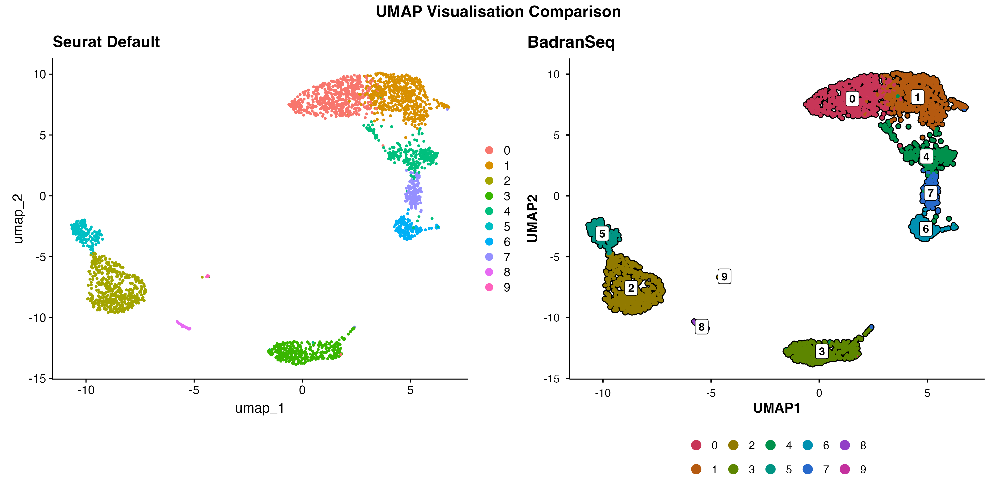
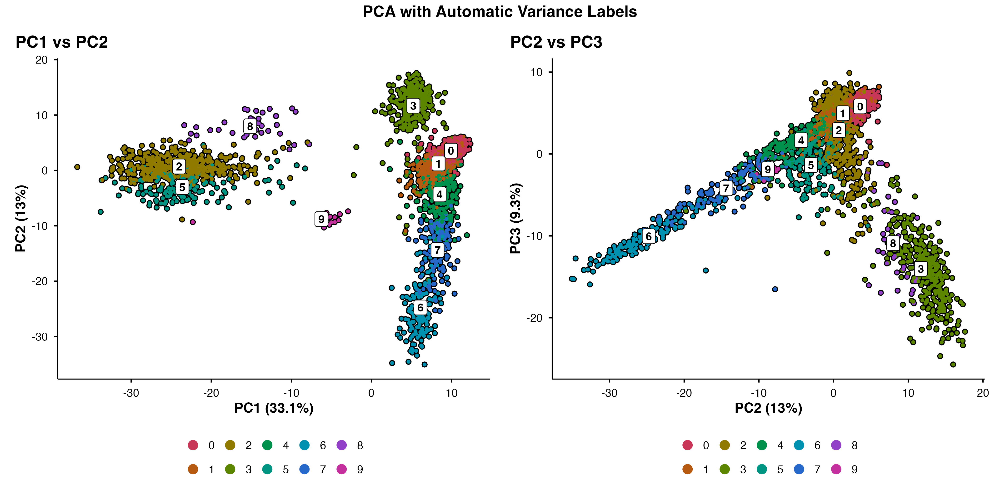
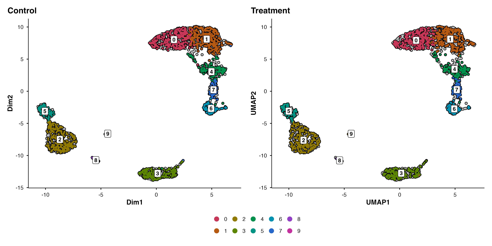
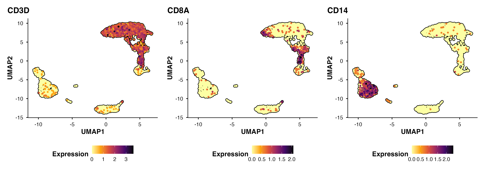
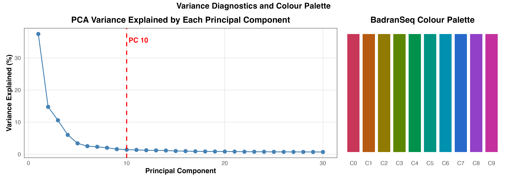
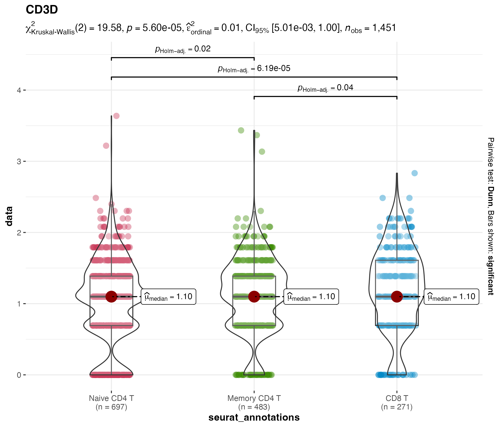
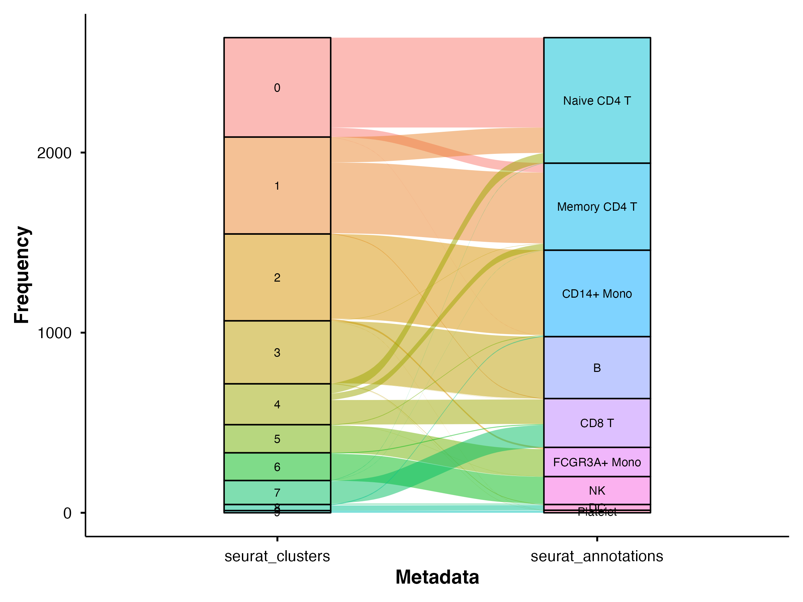

# BadranSeq — Manuscript

> **BadranSeq: Publication-Ready Visualisation for Single-Cell RNA Sequencing Data in R**
>
> Badran Elshenawy · [Nuffield Department of Medicine](https://www.ndm.ox.ac.uk/), University of Oxford

This repository contains the manuscript describing [BadranSeq](https://github.com/wolf5996/BadranSeq), an R package that turns Seurat objects into publication-ready figures with zero boilerplate.

<p align="center">
  
</p>
<p align="center"><em>Seurat's default UMAP (left) vs BadranSeq's <code>do_UmapPlot()</code> (right) — cell borders, cluster labels, and a publication theme out of the box.</em></p>

## Figures at a Glance

All figures are generated from a single script using the bundled PBMC 3k dataset.

| | |
|:---:|:---:|
|  |  |
| **PCA** — automatic variance-explained labels | **Split silhouette** — spatial context preserved across conditions |
|  |  |
| **Feature plot** — viridis scale with cell borders | **Elbow plot** + colour palette demo |
|  |  |
| **Statistical violin** — Kruskal-Wallis + Dunn's pairwise | **Sankey diagram** — cluster-to-annotation mapping |

## Building the Manuscript

Requires [Quarto](https://quarto.org/) (≥ 1.7.29) with typst support:

```bash
quarto render paper.qmd
```

## Repository Structure

```
paper/
├── paper.qmd                          # Main manuscript (Quarto + typst)
├── paper.pdf                          # Rendered output
├── references.bib                     # BibTeX bibliography (14 entries)
├── apa.csl                            # APA citation style
├── _extensions/                       # Quarto preprint-typst template
└── badranseq_joss_figures/
    ├── scripts/generate_figures.qmd   # R code for all 7 figures
    └── write/figures/                 # Output figures (SVG, PDF, PNG)
```

## Regenerating Figures

Figures are **pre-generated** — the manuscript itself contains no executable code. To regenerate them:

1. Install [BadranSeq](https://github.com/wolf5996/BadranSeq)
2. Open `badranseq_joss_figures/scripts/generate_figures.qmd` in RStudio
3. Run chunks interactively (code evaluation is disabled by default)

## Links

- **Package repo**: [github.com/wolf5996/BadranSeq](https://github.com/wolf5996/BadranSeq)
- **Documentation**: [wolf5996.github.io/BadranSeq](https://wolf5996.github.io/BadranSeq/)

## Citation

> Elshenawy, B. (2025). BadranSeq: Publication-Ready Visualisation for Single-Cell RNA Sequencing Data in R. *Preprint*.
