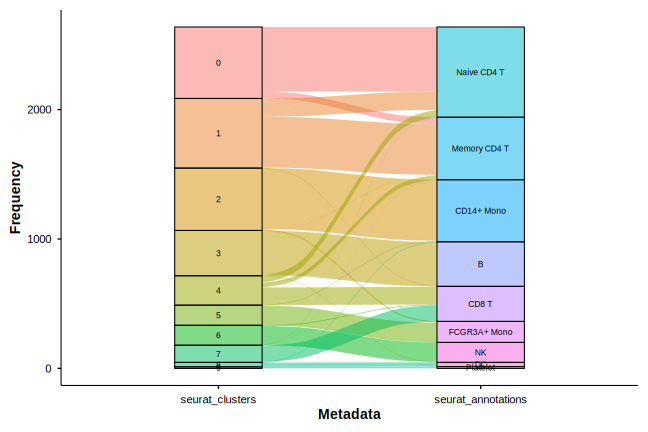

## Summary

Single-cell RNA sequencing (scRNA-seq) has become indispensable for dissecting cellular heterogeneity, yet a persistent disconnect separates exploratory analysis from the figures that appear in publications.
The Seurat toolkit [@hao2024; @stuart2019; @butler2018] --- the most widely adopted R framework for scRNA-seq --- provides plotting functions designed for rapid exploration, not for direct inclusion in manuscripts.
As a result, researchers repeatedly write the same boilerplate: computing and formatting PCA variance labels, adding cell borders for legibility, applying consistent themes, and building split-panel comparisons that retain the spatial context of the full embedding.

BadranSeq eliminates this burden.
Built entirely on native ggplot2 [@wickham2016], the package wraps the most common scRNA-seq visualisation tasks into single function calls that produce publication-ready output with no additional styling.
Key capabilities include automatic variance-explained annotations on PCA axes, cell border rendering, a silhouette-based split comparison that preserves spatial context across panels, statistical violin plots with integrated nonparametric testing via ggstatsplot [@patil2021], Sankey diagrams for categorical metadata relationships via ggalluvial [@brunson2020], tidy data extraction functions that replace `Seurat::FetchData()`, interactive brush-based cell selection, and a consistent publication theme applied across all outputs.
BadranSeq is available under the MIT licence at <https://github.com/wolf5996/BadranSeq>.

## Statement of Need

scRNA-seq enables gene expression profiling at single-cell resolution and has become a cornerstone of modern biology [@heumos2023; @luecken2019].
Seurat provides comprehensive workflows from raw count matrices through clustering, annotation, and visualisation, making it the *de facto* standard for scRNA-seq analysis in R.
Its plotting functions, however, prioritise generality over presentation quality.
Every project ends with the same ritual: computing PCA variance percentages, adding cell borders, styling themes, and constructing split-panel layouts that preserve embedding geometry.
This work is repeated across every analysis, every manuscript, and every laboratory.

The cost is not merely time.
Inconsistent visualisation code across projects hinders reproducibility of visual outputs and introduces opportunities for error.
SCpubr [@blancocarmona2022] addressed this gap with a large suite of specialised plotting functions, but its breadth introduces a substantial dependency burden: 56 direct dependencies compared to 19 for BadranSeq (@fig-dependency).
This 66\% reduction in dependency footprint translates to faster installation, fewer version conflicts, and reduced long-term maintenance overhead---particularly important when only core dimensionality reduction and feature plots are needed.

Three additional gaps remain underserved.
First, interactive cell selection: researchers frequently need to isolate spatially defined populations that do not correspond to existing metadata labels.
Seurat's `CellSelector()` is tightly coupled to its own plotting pipeline and lacks additive or subtractive selection modes.
Second, statistical annotation: comparing expression distributions across cell types requires manually extracting data, running tests, and formatting results onto plots.
Third, tidy data extraction: `FetchData()` returns a data.frame with barcodes trapped in rownames, mixes expression and metadata in a single call, and provides no control over expression layers.

BadranSeq addresses all of these.
It provides a lightweight, opinionated visualisation and data extraction layer covering UMAP, PCA, feature expression, elbow plots, statistical violin plots, Sankey diagrams, and tidy data extraction --- with defaults that require no additional customisation.
By building directly on ggplot2 rather than wrapping higher-level abstractions, every output remains a standard ggplot2 object that researchers can further modify using familiar syntax.

## State of the Field

Several tools address scRNA-seq visualisation in R (@fig-comparison, @fig-featureplot, @fig-silhouette, @fig-violin).
Seurat's built-in `DimPlot()` and `FeaturePlot()` [@hao2024] provide basic plotting but require manual styling for publication use---as demonstrated in the top rows of the comparison figures, Seurat outputs lack cell borders, consistent themes, and statistical annotations.
SCpubr [@blancocarmona2022] offers over 30 specialised plot types with publication aesthetics, but requires 56 direct dependencies compared to 19 for BadranSeq---a 66\% larger dependency footprint that increases installation time and version conflict risk (@fig-dependency).
dittoSeq provides colourblind-friendly visualisations with a focus on accessibility.
scater, part of the Bioconductor ecosystem, includes plotting utilities integrated with the SingleCellExperiment class.

BadranSeq occupies a distinct position.
Unlike Seurat's defaults, it produces publication-ready output without customisation, as shown in the bottom rows of the comparison figures.
Unlike SCpubr, it focuses on the core visualisation tasks that researchers use daily, achieving equivalent publication aesthetics with a 66\% smaller dependency footprint.
Unlike dittoSeq and scater, it operates natively on Seurat objects and integrates directly with the dominant scRNA-seq workflow.

@tbl-comparison summarises the functional differences.

| Feature                        | Seurat | SCpubr | BadranSeq |
|:-------------------------------|:------:|:------:|:---------:|
| Variance explained on PCA axes |   No   |   Yes  |    Yes    |
| Cell borders                   |   No   |   Yes  |    Yes    |
| Cluster labels by default      |   No   |   Yes  |    Yes    |
| Split-panel silhouettes        |   No   |   Yes  |    Yes    |
| Publication theme              |   No   |   Yes  |    Yes    |
| Viridis feature plots          |   No   |   Yes  |    Yes    |
| Interactive cell selection     |  Limited |  No   | Additive / subtractive |
| Statistical violin plots       |   No   |   Yes  | Kruskal--Wallis |
| Sankey / alluvial diagrams     |   No   |   Yes  |    Yes    |
| Tidy data extraction           |  FetchData | No  | Tibble-based |
| Direct dependencies            |   ---  |   56   |    19     |

: Comparison of default capabilities between Seurat, SCpubr, and BadranSeq. {#tbl-comparison}

## Software Design

BadranSeq is built on a unified architecture where all functions accept Seurat objects and return native ggplot2 objects, preserving compatibility with existing workflows whilst eliminating repetitive styling steps. The package follows a "sensible defaults" philosophy: each function produces publication-ready output without requiring additional customisation, yet returned plots remain standard ggplot objects for optional downstream modification.

The design addresses a critical gap in the Seurat ecosystem. Whilst Seurat excels at data processing, its plotting functions prioritise flexibility over presentation quality, forcing researchers to repeatedly perform manual styling tasks---adding variance labels, configuring colour scales, applying consistent themes---rather than focusing on biological interpretation. BadranSeq automates these decisions using established visualisation best practices, as demonstrated across the comparison figures (@fig-comparison, @fig-pca, @fig-featureplot, @fig-elbow, @fig-silhouette, @fig-violin).

The architecture employs a routing pattern where `do_DimPlot()` serves as a unified entry point, dispatching to specialised functions based on the requested reduction type. This enables consistent interfaces across visualisation types whilst allowing reduction-specific enhancements such as automatic variance annotation for PCA or optimised colour scaling for feature plots. Detailed code comparisons demonstrating efficiency gains over standard Seurat workflows are provided in Appendix A.

### Dimensionality Reduction Visualisations

#### UMAP: Publication-Ready Defaults

UMAP embeddings are typically the first figure readers encounter in scRNA-seq publications, making default output quality critical for effective scientific communication.
The standard Seurat workflow produces functional but visually sparse plots that require extensive manual styling to meet publication standards.
This creates a reproducibility gap: the code that generates exploratory plots differs substantially from the code that produces the final published figures, complicating both methods sections and computational reproducibility.

BadranSeq addresses this by implementing publication-oriented defaults in `do_UmapPlot()`.
The function automatically applies cell borders to improve legibility in high-density regions, positions cluster labels using an intelligent algorithm that avoids overlaps, and applies a carefully tuned categorical colour palette designed for maximum visual distinction.
The underlying theme removes distracting grid lines, optimises text sizing for publication, and ensures consistent legend positioning across all plot types.

```r
# Seurat default approach
p1 <- DimPlot(seurat_obj, reduction = "umap")

# BadranSeq equivalent
p2 <- do_UmapPlot(seurat_obj)
```

The code comparison illustrates the efficiency gain: a single `do_UmapPlot()` call produces output that would require multiple manual modifications in Seurat, including theme adjustments, colour palette selection, and border application.
More importantly, the defaults are consistent across different datasets and cell type compositions, eliminating the need to re-tune parameters for each analysis.

The visual improvements extend beyond aesthetics.
Cell borders significantly improve readability in dense UMAP regions where overlapping points can obscure population boundaries.
The automated label placement algorithm positions text to avoid occlusion whilst maintaining proximity to cluster centroids.
The colour palette selection emphasises perceptual uniformity and accessibility, with sufficient contrast to distinguish adjacent populations even in print or when viewed by readers with colour vision deficiencies.

{#fig-comparison width="100%"}

#### PCA: Automatic Variance Annotation

Principal component analysis visualisations face a fundamental interpretability problem: without variance context, PC1 versus PC2 plots become meaningless to readers.
Yet Seurat's default `DimPlot()` omits this crucial information, forcing researchers to manually extract variance percentages from the `@misc$pca` slot and format axis labels appropriately.
This manual process introduces opportunities for error and inconsistency, particularly when generating multiple PCA views or when variance calculations require updates after data processing changes.

BadranSeq's `do_PcaPlot()` automatically computes and formats variance-explained labels for any requested PC combination.
The function accesses the standard deviations stored in the Seurat object's PCA reduction, converts these to variance percentages using established formulas, and formats the axis labels appropriately.
This automation eliminates a common source of figure preparation overhead whilst ensuring mathematical accuracy and consistency across all PCA visualisations.

```r
# Seurat: manual variance extraction and formatting
pca_var <- (seurat_obj@reductions$pca@stdev)^2
pca_percent <- round(100 * pca_var / sum(pca_var), 1)
p1 <- DimPlot(seurat_obj, reduction = "pca") +
  xlab(paste0("PC1 (", pca_percent[1], "%)")) +
  ylab(paste0("PC2 (", pca_percent[2], "%)"))

# BadranSeq: automatic annotation
p2 <- do_PcaPlot(seurat_obj, dims = c(1, 2))
```

The manual approach requires understanding of Seurat's internal data structure, correct variance calculation (squaring standard deviations, converting to percentages), and proper ggplot2 axis label modification.
The BadranSeq approach encapsulates this domain knowledge, reducing both cognitive load and error probability whilst enabling rapid generation of multiple PC combinations.

Beyond convenience, automatic variance annotation enables more rigorous interpretation of PC plots.
Researchers can immediately assess whether the visualised components capture sufficient variance to warrant biological interpretation, compare variance contributions across different PC pairs, and make informed decisions about dimensionality reduction parameters.
This quantitative context is essential for methods sections and supports more robust biological conclusions.

The variance calculation integrates seamlessly with other aspects of PCA interpretation, as discussed in Section 4.3 where `EnhancedElbowPlot()` provides complementary variance diagnostics for the complete PC spectrum.

{#fig-pca width="100%"}


### Feature Expression Visualisation

Gene expression overlays constitute a fundamental figure class in scRNA-seq publications, typically appearing as multi-panel displays showing canonical markers across cell populations.
These figures serve dual purposes: validating computational cell type assignments and demonstrating expression patterns to support biological conclusions.
However, default Seurat implementations suffer from several visualisation problems that compromise both readability and quantitative interpretation.

The primary challenge involves colour scale selection and dynamic range handling.
Seurat's default `FeaturePlot()` applies a basic colour gradient that lacks perceptual uniformity, meaning that equal steps in colour intensity do not correspond to equal steps in perceived difference.
This complicates quantitative interpretation, as readers cannot reliably assess relative expression levels from visual inspection alone.
Additionally, the default approach lacks cell borders, making individual cells indistinguishable in high-density UMAP regions where overlapping points obscure expression boundaries.

BadranSeq's `do_FeaturePlot()` addresses these limitations through systematic application of the viridis colour scale [@garnier2024], which provides perceptual uniformity and accessibility for readers with colour vision deficiencies.
The function automatically applies cell borders to improve legibility in dense regions, implements intelligent legend positioning, and provides optional quantile-based expression cutoffs to handle outlier values appropriately.

```r
# Seurat: basic feature plot with manual styling needs
p1 <- FeaturePlot(seurat_obj, features = c("CD3D", "CD8A", "CD14"))

# BadranSeq: publication-ready defaults with viridis scale and borders
p2 <- do_FeaturePlot(seurat_obj, features = c("CD3D", "CD8A", "CD14"))

# BadranSeq: with quantile cutoffs for outlier handling
p3 <- do_FeaturePlot(seurat_obj, features = c("CD3D", "CD8A", "CD14"),
                     min.cutoff = "q10", max.cutoff = "q90")
```

The quantile cutoff functionality deserves particular attention, as single-cell expression data frequently contains extreme outliers that compress the meaningful dynamic range into a narrow portion of the colour scale.
By specifying `min.cutoff` and `max.cutoff` parameters, researchers can focus the colour mapping on biologically relevant expression ranges whilst maintaining statistical rigour.
This approach outperforms arbitrary threshold selection and provides consistent treatment across different genes with varying expression magnitudes.

Multi-gene panels benefit substantially from these improvements, as consistent colour scaling and border application enable direct visual comparison across markers.
The perceptual uniformity of the viridis scale ensures that apparent differences in expression intensity reflect genuine quantitative differences rather than artifacts of colour perception.
This property becomes crucial when generating complex panels showing differentiation markers, signalling pathway components, or temporal expression patterns.

The integration with ggplot2's grammar of graphics ensures that researchers retain full control over plot customisation despite the opinionated defaults.
Advanced users can modify individual components---adjusting point sizes for different cell densities, overlaying contour lines, or applying custom transformations---whilst maintaining the core advantages of consistent theming and colour scale selection.

{#fig-featureplot width="100%"}

### Variance Diagnostics

Principal component selection represents a critical decision point in scRNA-seq analysis workflows, directly affecting downstream clustering, trajectory inference, and differential expression testing.
Yet this decision typically relies on subjective interpretation of elbow plots showing standard deviations across principal components.
Seurat's default `ElbowPlot()` provides the raw standard deviation values but requires manual conversion to variance percentages and subjective identification of the "elbow" position where marginal variance contributions become negligible.

BadranSeq's `EnhancedElbowPlot()` transforms this diagnostic process by automatically computing and displaying variance explained alongside an optional cutoff annotation.
The function converts standard deviations to variance percentages using the same mathematical framework as `do_PcaPlot()`, ensuring consistency across all variance-related visualisations in the analysis pipeline.
The cutoff functionality allows researchers to overlay their PC selection decision directly onto the diagnostic plot, creating a clear visual record for methods sections and enabling rapid assessment of alternative cutoff scenarios.

```r
# Seurat: basic elbow plot requiring manual interpretation
p1 <- ElbowPlot(seurat_obj, ndims = 30)

# BadranSeq: variance explained with optional cutoff annotation
p2 <- EnhancedElbowPlot(seurat_obj, ndims = 30, cutoff_pc = 15)

# Extract variance data for custom analysis
variance_df <- get_pca_variance(seurat_obj)
```

The integration of variance diagnostics with other PCA visualisations creates a coherent analytical narrative.
Researchers can examine the overall variance distribution using `EnhancedElbowPlot()`, visualise specific PC combinations using `do_PcaPlot()` (as described in Section 4.1), and make informed decisions about the appropriate dimensionality for downstream analysis.
This workflow eliminates common inconsistencies where PC selection criteria differ between exploratory analysis and final figure preparation.

The `get_pca_variance()` function provides programmatic access to the underlying variance calculations, enabling advanced users to implement custom selection criteria or integrate variance information into automated analysis pipelines.
This data-driven approach to PC selection supports more rigorous reporting in methods sections and facilitates systematic parameter exploration across multiple datasets.

Beyond diagnostic utility, the enhanced elbow plot format communicates methodological decisions more effectively to readers.
The variance percentage scale enables direct assessment of information retention, whilst the cutoff annotation clarifies the analytical choices underlying downstream results.
This transparency becomes particularly valuable for high-dimensional datasets where PC selection substantially influences biological conclusions.

{#fig-elbow width="80%"}

### Split-Panel Context Preservation

Comparative visualisations across experimental conditions or time points represent a fundamental requirement in scRNA-seq analysis, yet standard faceting approaches systematically destroy the spatial context that makes UMAP embeddings interpretable.
When researchers apply Seurat's `split.by` parameter, each panel displays only the subset of cells corresponding to that condition, creating visually isolated plots that obscure spatial relationships between populations.
This fragmentation becomes particularly problematic when analysing treatment responses, developmental trajectories, or disease progression, where understanding relative positioning within the complete cellular landscape proves essential for biological interpretation.

The mathematical intuition underlying this problem relates to the fundamental properties of dimensionality reduction algorithms.
UMAP and t-SNE construct embeddings by preserving local neighbourhood structures across the complete dataset; when subsets of cells are visualised in isolation, these neighbourhood relationships become invisible, potentially leading to misinterpretation of population boundaries and relative distances.
A population that appears isolated in a condition-specific panel might actually sit adjacent to other cell types in the complete embedding, dramatically altering its biological interpretation.

BadranSeq addresses this challenge through a silhouette-based visualisation approach that preserves complete spatial context whilst highlighting condition-specific populations.
The `do_UmapPlot()` function, when provided with a `split.by` parameter, renders all cells as grey silhouettes with borders in each panel, then overlays only the cells corresponding to the current condition in colour.
This approach maintains the geometric relationships established by the dimensionality reduction algorithm whilst enabling clear identification of condition-specific cell distributions.

```r
# Seurat: standard faceting loses spatial context
p1 <- DimPlot(seurat_obj, split.by = "condition")

# BadranSeq: silhouette approach preserves context
p2 <- do_UmapPlot(seurat_obj, split.by = "condition")

# Advanced: explicit border control
p3 <- do_UmapPlot(seurat_obj, split.by = "condition",
                  plot_cell_borders = TRUE)
```

The implementation leverages patchwork [@pedersen2020] to combine panels with shared legends and consistent axis limits, ensuring that spatial relationships remain interpretable across conditions.
The grey silhouette approach provides sufficient visual context to understand population positioning without overwhelming the highlighted cells of interest.
Border application ensures that individual cells remain distinguishable even in high-density regions where overlapping points might otherwise obscure population boundaries.

This visualisation strategy proves particularly valuable for longitudinal studies, treatment comparisons, and developmental analyses where spatial relationships convey critical biological information.
Researchers can immediately assess whether treatment-responsive populations occupy distinct spatial domains, whether developmental progression follows continuous trajectories, or whether disease-associated cells cluster in specific regions of the cellular landscape.
Such insights become impossible to extract from traditional faceted plots but emerge naturally from the silhouette approach.

The method scales effectively to multiple conditions and integrates seamlessly with other BadranSeq features, including automatic colour palette generation and consistent theming.
Advanced users retain full control over silhouette transparency, border properties, and panel arrangement whilst benefiting from the preserved spatial context that facilitates rigorous biological interpretation.

{#fig-silhouette width="100%"}

### Statistical Annotation Integration

Expression distribution comparisons across cell types constitute a standard analytical task in scRNA-seq research, yet the conventional workflow requires substantial manual effort and statistical expertise.
Researchers must extract expression data using `Seurat::FetchData()`, wrangle the returned data structure into appropriate format, select and apply suitable statistical tests for the data distribution characteristics, and manually format results onto violin or box plots.
This process becomes particularly cumbersome when comparing multiple genes across numerous cell type combinations, where the manual workflow scales poorly and introduces opportunities for statistical or formatting errors.

The statistical challenges extend beyond workflow efficiency to methodological appropriateness.
Single-cell expression data exhibits substantial zero-inflation, overdispersion, and non-normal distributions that violate the assumptions of standard parametric tests.
Non-parametric approaches such as the Kruskal--Wallis test and Dunn's pairwise comparisons represent more appropriate choices, yet these require statistical knowledge to implement correctly and format appropriately for publication.

BadranSeq's `do_StatsViolinPlot()` integrates the complete statistical testing workflow into a single function call that handles data extraction, test selection, multiple comparison correction, and result formatting automatically.
The function wraps `ggstatsplot::ggbetweenstats()` [@patil2021] whilst providing Seurat-aware data extraction, automatic palette generation consistent with other BadranSeq functions, and a `group.levels` argument that enables subset comparisons without manual object manipulation.

```r
# Seurat: manual workflow requiring statistical expertise
expression_data <- FetchData(seurat_obj, vars = c("CD3D", "seurat_annotations"))
# ... manual data wrangling, test selection, formatting ...
p1 <- VlnPlot(seurat_obj, features = "CD3D", group.by = "seurat_annotations")

# BadranSeq: integrated statistical testing with automatic formatting
p2 <- do_StatsViolinPlot(seurat_obj, features = "CD3D", 
                         group.by = "seurat_annotations",
                         group.levels = c("Naive CD4 T", "Memory CD4 T", "CD8 T"))

# Control statistical annotation display
p3 <- do_StatsViolinPlot(seurat_obj, features = "CD3D",
                         group.by = "seurat_annotations", 
                         pairwise.display = "significant")
```

The function performs Kruskal--Wallis omnibus testing by default, with Dunn's pairwise comparisons using Holm correction for multiple testing.
The statistical results are formatted directly onto the plot with publication-appropriate typography, eliminating the need for manual annotation or separate statistical analysis workflows.
The `pairwise.display` parameter provides control over result presentation, allowing researchers to show all pairwise comparisons, only statistically significant pairs, or suppress brackets entirely whilst retaining the omnibus test results.

The `group.levels` parameter deserves particular attention as it enables focused comparisons without requiring manual Seurat object subsetting.
This functionality proves essential when analysing large datasets with numerous cell type annotations, where comprehensive pairwise testing might produce cluttered output whilst subset comparisons target specific biological hypotheses.
The parameter accepts character vectors specifying the exact cell type labels to include, maintaining statistical rigour whilst improving interpretability.

Integration with the broader BadranSeq ecosystem ensures visual consistency with other plot types, including colour palette selection, theme application, and legend positioning.
The underlying `ggstatsplot` framework provides access to advanced statistical options for users requiring alternative test procedures, whilst the Seurat-aware wrapper handles the most common use cases with appropriate defaults.

This automated approach to statistical annotation represents a substantial improvement over manual workflows, particularly for exploratory analysis where multiple comparisons across different genes and cell type combinations require rapid iteration.
The consistent formatting and methodological choices support reproducible research practices whilst reducing the statistical expertise required for appropriate test selection and result interpretation.

As discussed in Section 4.8, the statistical functionality integrates seamlessly with BadranSeq's tidy data extraction capabilities, enabling researchers to access the underlying statistical results for custom analysis workflows whilst benefiting from the automated visualisation pipeline.

{#fig-violin width="90%"}

### Categorical Relationship Visualisation

Metadata relationships in single-cell datasets often exhibit complex many-to-many mappings that resist effective representation through standard tabular formats.
The relationship between computational cluster assignments and biological cell type annotations exemplifies this challenge: whilst researchers expect clean one-to-one correspondences, real datasets frequently display clusters that span multiple cell types or cell types that fragment across multiple clusters.
Traditional approaches rely on contingency tables or correlation matrices that obscure the flow patterns underlying these relationships, making it difficult to assess annotation quality or identify problematic assignments.

Sankey diagrams provide an intuitive alternative that emphasises flow relationships over static associations.
BadranSeq's `do_SankeyPlot()` leverages the ggalluvial package [@brunson2020] to create alluvial visualisations that render each metadata category as a vertical stratum, with flows between strata representing the cell distributions across categories.
The width of each flow corresponds directly to the number of cells sharing that combination of metadata values, providing immediate visual feedback about the strength of different associations.

```r
# Simple two-column comparison: clusters to annotations
p1 <- do_SankeyPlot(seurat_obj, columns = c("seurat_clusters", "seurat_annotations"))

# Three-way relationship: clusters to annotations to treatment response
p2 <- do_SankeyPlot(seurat_obj, columns = c("seurat_clusters", "seurat_annotations", "response"))
```

The visualisation approach proves particularly valuable for assessing the quality of automated cell type annotation workflows.
Clean one-to-one mappings appear as non-branching flows between single cluster and annotation strata, whilst problematic assignments manifest as complex branching patterns that immediately highlight areas requiring manual review.
This visual diagnostic capability enables rapid quality assessment across large annotation projects and facilitates systematic improvement of annotation algorithms.

Beyond cluster validation, Sankey diagrams excel at exploring complex metadata relationships that involve three or more categorical variables.
Treatment response patterns, developmental stage progressions, and tissue-specific expression signatures often involve intricate multi-way interactions that become apparent through alluvial visualisation but remain hidden in pairwise comparisons.
The flowing visual metaphor aligns naturally with biological processes involving state transitions or population dynamics.

The integration with BadranSeq's theming system ensures consistent visual presentation with other plot types, whilst the underlying ggalluvial implementation provides access to advanced formatting options for specialised applications.
Automatic colour assignment follows the same palette generation logic used throughout the package, maintaining visual consistency whilst ensuring sufficient contrast for category discrimination.

{#fig-sankey width="90%"}

### Dependency Engineering

The evolution of the R package ecosystem has created increasingly complex dependency webs that impose substantial hidden costs on end users.
While feature-rich packages offer comprehensive functionality, they often require large dependency trees that complicate installation, increase vulnerability to version conflicts, and impose long-term maintenance burdens that may exceed the value of the additional features.
This presents a particular challenge for visualisation packages, where the core functionality (creating publication-ready plots) can be achieved with modest dependencies, yet comprehensive implementations may bundle extensive additional features that most users never require.

The dependency question becomes critical in computational research environments where package installations must remain stable across extended project timelines, often spanning multiple years.
Version conflicts between dependencies can render previously functional code inoperable, particularly when different packages require incompatible versions of shared dependencies.
Continuous integration systems amplify these problems, as dependency resolution failures can break entire analytical pipelines for reasons unrelated to the scientific content.

BadranSeq adopts a minimalist dependency philosophy that prioritises core functionality over comprehensive feature coverage.
The package maintains only 19 direct dependencies compared to 56 for SCpubr---a 66\% reduction that translates directly to reduced complexity in dependency resolution, faster installation times, and lower probability of version conflicts.
This streamlined approach does not compromise functionality for the core visualisation tasks that researchers perform daily: UMAP plots, feature expression overlays, PCA visualisations, and basic statistical comparisons.

The comparison quantified in @fig-dependency illustrates the practical implications of this design choice.
Installation time scales approximately linearly with dependency count, particularly in environments with limited network bandwidth or when dependencies require compilation.
Version conflict probability increases combinatorially, as each additional dependency introduces potential incompatibilities with all existing dependencies.
Long-term maintenance overhead grows similarly, as package updates may require resolving conflicts across the entire dependency tree rather than focusing on the core functionality that users actually require.

BadranSeq achieves this reduction through careful selection of established, stable packages with minimal transitive dependencies.
The core visualisation capabilities rely primarily on ggplot2, which provides a mature and stable foundation for publication-quality graphics.
Statistical functionality leverages ggstatsplot for automated testing, whilst maintaining the option for users to implement custom statistical workflows using the extracted data structures.
This approach preserves flexibility whilst avoiding the dependency overhead associated with comprehensive statistical frameworks.

The architectural decision aligns with broader trends in software engineering towards modular, focused packages that excel at specific tasks rather than attempting comprehensive feature coverage.
Users benefit from reduced complexity, increased reliability, and clearer maintenance expectations, whilst retaining the ability to combine BadranSeq with other specialised packages for advanced workflows that require functionality beyond the core visualisation tasks.

As detailed in Table 1, this dependency reduction does not compromise feature parity with existing solutions.
BadranSeq provides equivalent or superior functionality across all major visualisation categories whilst maintaining the 66\% dependency advantage that supports long-term analytical reproducibility.

{#fig-dependency width="80%"}

### Data Extraction and Interoperability

The interface between single-cell analysis and downstream visualisation or statistical workflows often encounters friction at the data extraction step.
Seurat's `FetchData()` function, whilst functional, returns data structures that conflict with modern tidy data principles and require manual reshaping for integration with dplyr and ggplot2 workflows.
The function traps cell barcodes in rownames rather than explicit columns, mixes expression and metadata in single calls without clear layer specification, and returns data frames that require extensive manipulation before use in typical analytical pipelines.

BadranSeq addresses these limitations through two complementary data extraction functions that embrace tidy data principles and provide explicit control over the extracted information.
`fetch_cell_data()` returns cell-level metadata and dimensionality reduction coordinates as a tidy tibble with `cell_id` as an explicit column, enabling direct integration with dplyr verbs and eliminating the rowname manipulation that complicates downstream analysis.
`fetch_feature_data()` extracts expression data in long format with one row per cell-feature combination, providing explicit control over expression layers and enabling seamless integration with ggplot2's aesthetic mapping system.

```r
# Seurat: FetchData returns mixed structure with trapped rownames
seurat_data <- FetchData(seurat_obj, vars = c("CD3D", "UMAP_1", "UMAP_2", "seurat_annotations"))
# Requires manual conversion of rownames to explicit column

# BadranSeq: tidy extraction with explicit cell identifiers
cell_metadata <- fetch_cell_data(seurat_obj, 
                                 embeddings = "umap", 
                                 metadata_cols = "seurat_annotations")

expression_data <- fetch_feature_data(seurat_obj,
                                      features = c("CD3D", "CD8A", "CD14"),
                                      layers = c("counts", "data"))
```

The tidy approach facilitates composable analytical workflows that leverage the full power of the tidyverse ecosystem.
Researchers can apply standard dplyr operations (filtering, grouping, summarising) directly to the extracted data without preprocessing steps, chain operations using pipe operators, and integrate results seamlessly with ggplot2 visualisations or custom statistical procedures.
This compatibility eliminates a common source of analysis friction and supports more exploratory, iterative approaches to data investigation.

The explicit layer control provided by `fetch_feature_data()` addresses another common source of confusion in Seurat workflows.
Modern Seurat objects may contain multiple expression layers (raw counts, normalised data, scaled data, integrated values), and different analytical tasks require different layers.
By making layer selection explicit and providing clear column naming conventions, BadranSeq eliminates ambiguity about which expression values are being analysed and supports reproducible reporting of analytical choices.

Interactive cell selection capabilities complement the data extraction functionality through `select_cells_interactive()`, which provides a Shiny-based interface for brush-selecting cells from any computed embedding.
The function supports additive selection modes (building complex selections through multiple brush operations), subtractive modes (removing unwanted cells from existing selections), and returns either character vectors of cell barcodes or subsetted Seurat objects for downstream analysis.
This interactivity surpasses Seurat's `CellSelector()` in flexibility whilst maintaining compatibility with standard Seurat workflows.

Performance considerations become relevant for large datasets, where visualisation functions automatically apply rasterisation to point layers exceeding configurable cell count thresholds.
The `ggrastr` integration maintains vector formatting for text and axis elements whilst converting dense point clouds to raster graphics, preventing prohibitively large file sizes without compromising visual quality.
This automation eliminates manual performance tuning whilst ensuring that generated figures remain suitable for publication across different dataset scales.

### Interactive Cell Selection

`select_cells_interactive()` provides a Shiny-based interface for brush-selecting cells from any computed embedding.
Users can additively build a selection across multiple brush operations, subtractively remove cells, and clear to start over.
Selected cells are highlighted with red ring markers in real time, and the function returns either a character vector of barcodes or a subsetted Seurat object.
This is more flexible than Seurat's `CellSelector()`, which lacks additive and subtractive modes.

Additionally, `seurat_sleepwalk()` wraps the sleepwalk package [@ovchinnikova2020] for interactive exploration of how faithfully a 2D embedding preserves high-dimensional distances.

### Performance

For datasets exceeding 50,000 cells, BadranSeq automatically rasterises point layers via ggrastr, preventing prohibitively large vector graphics while keeping text and axes as sharp vector elements.
The threshold is configurable through the `raster` parameter.

## Availability and Reproducibility

BadranSeq is publicly available on GitHub and installable via standard R package managers.
The package ships with a bundled PBMC 3k dataset (SCTransform-normalised, with PCA and UMAP precomputed) for immediate testing and reproducible examples.
A pkgdown documentation site at <https://wolf5996.github.io/BadranSeq/> provides function references and usage vignettes.
Continuous integration via GitHub Actions runs `R CMD check` on macOS, Windows, and Ubuntu.

## Acknowledgements

The aesthetic design of BadranSeq draws on SCpubr [@blancocarmona2022] by Enrique Blanco Carmona.
Design elements adapted from SCpubr include cell border rendering, colour palette generation, and the silhouette split approach.
BadranSeq differs by providing a lighter-weight, native ggplot2 implementation with a 66\% smaller dependency footprint (19 versus 56 direct dependencies) while adding unique capabilities including PCA variance labels, statistical violin plots, Sankey diagrams, tidy data extraction, and interactive cell selection.

The author thanks the developers of R [@rcore2024], Seurat [@hao2024], ggplot2 [@wickham2016], ggstatsplot [@patil2021], ggalluvial [@brunson2020], and UMAP [@mcinnes2018] for the foundational tools upon which BadranSeq is built.

## Appendix A: Code Efficiency Comparisons

This appendix presents side-by-side code comparisons demonstrating the efficiency gains of BadranSeq over standard Seurat workflows. Each example shows the manual customisation required to achieve publication-ready output versus the single-function-call approach enabled by BadranSeq's sensible defaults.

### A.1 UMAP Visualisation

**Seurat approach:** Basic exploratory plot requiring extensive manual styling.

```r
# Basic plot - lacks publication features
p <- DimPlot(seurat_obj, reduction = "umap")

# Required manual additions for publication quality:
p <- DimPlot(seurat_obj, reduction = "umap") +
  theme_minimal() +                                    # Clean theme
  theme(
    panel.grid = element_blank(),                     # Remove grid
    axis.text = element_text(size = 10),             # Consistent text
    legend.position = "bottom"                        # Position legend
  ) +
  scale_color_manual(values = custom_palette) +       # Accessible colours
  # Additional code for cell borders, label positioning, etc.
```

**BadranSeq approach:** Publication-ready output with automatic styling.

```r
# Single function call produces publication-ready output
p <- do_UmapPlot(seurat_obj)
# Automatic: theme_badranseq(), cell borders, label placement, 
# perceptually uniform palette, optimised text sizing
```

**Efficiency gain:** One function call replaces 10-15 lines of manual customisation, with consistent defaults across all analyses.

### A.2 PCA with Variance Annotation

**Seurat approach:** Manual variance extraction and axis labelling.

```r
# Extract variance information manually
pca_var <- (seurat_obj@reductions$pca@stdev)^2
pca_percent <- round(100 * pca_var / sum(pca_var), 1)

# Create plot with manual axis labels
p <- DimPlot(seurat_obj, reduction = "pca") +
  xlab(paste0("PC1 (", pca_percent[1], "%)")) +
  ylab(paste0("PC2 (", pca_percent[2], "%)")) +
  theme_minimal() +
  theme(panel.grid = element_blank())

# Must repeat for each PC combination
```

**BadranSeq approach:** Automatic variance annotation for any PC combination.

```r
# Automatic variance annotation
p <- do_PcaPlot(seurat_obj, dims = c(1, 2))
# Automatic: variance extraction, percentage calculation, 
# formatted axis labels, publication theme
```

**Efficiency gain:** Eliminates manual `@reductions` slot access, variance calculation, and label formatting. Consistent across all PC combinations.

### A.3 Feature Expression Visualisation

**Seurat approach:** Basic feature plot with default colour scale.

```r
# Default plot with problematic colour scale
p <- FeaturePlot(seurat_obj, features = c("CD3D", "CD8A", "CD14"))

# Required additions for publication quality:
p <- FeaturePlot(
  seurat_obj, 
  features = c("CD3D", "CD8A", "CD14"),
  cols = viridis(100),                    # Perceptually uniform scale
  pt.size = 0.5,                          # Adjust point size
  order = TRUE                            # Order by expression
) +
  theme_minimal() +
  theme(panel.grid = element_blank())
# Additional code needed for cell borders, outlier handling
```

**BadranSeq approach:** Optimised feature plots with automatic colour scaling and borders.

```r
# Automatic viridis scale, cell borders, outlier handling
p <- do_FeaturePlot(seurat_obj, features = c("CD3D", "CD8A", "CD14"))

# With quantile cutoffs for outlier handling
p <- do_FeaturePlot(
  seurat_obj, 
  features = c("CD3D", "CD8A", "CD14"),
  min.cutoff = "q10", 
  max.cutoff = "q90"
)
```

**Efficiency gain:** Single call replaces manual colour scale selection, cell border addition, and outlier threshold configuration.

### A.4 Split-Panel Comparisons

**Seurat approach:** Standard faceting loses spatial context.

```r
# Default split.by faceting - each panel shows only subset
p <- DimPlot(seurat_obj, reduction = "umap", split.by = "condition")
# Result: panels lack context of full embedding geometry
```

**BadranSeq approach:** Silhouette method preserves spatial context.

```r
# Silhouette approach shows all cells in background
p <- do_UmapPlot(seurat_obj, split.by = "condition")
# Automatic: grey silhouettes of all cells, coloured overlay 
# for target condition, preserved spatial relationships
```

**Efficiency gain:** Single parameter enables sophisticated visualisation technique that would require complex manual ggplot2 construction in standard workflow.

### A.5 Statistical Violin Plots

**Seurat approach:** Basic violin plot without statistical testing.

```r
# Basic violin plot - no statistics
p <- VlnPlot(
  seurat_obj, 
  features = "CD3D",
  group.by = "seurat_annotations",
  pt.size = 0
)

# Manual statistical workflow required:
# 1. Extract expression data with FetchData()
# 2. Wrangle into appropriate format
# 3. Perform Kruskal-Wallis test
# 4. Run Dunn's pairwise comparisons
# 5. Format results for plotting
# 6. Add annotations manually
```

**BadranSeq approach:** Integrated statistical testing with automatic annotation.

```r
# Automatic Kruskal-Wallis and Dunn's pairwise comparisons
p <- do_StatsViolinPlot(
  seurat_obj,
  features = "CD3D",
  group.by = "seurat_annotations",
  group.levels = c("Naive CD4 T", "Memory CD4 T", "CD8 T")
)
# Automatic: data extraction, statistical testing, 
# multiple comparison correction, formatted annotations
```

**Efficiency gain:** Single function replaces complete statistical workflow (extraction, testing, formatting) with appropriate non-parametric tests and publication-ready annotation.

### A.6 Variance Diagnostics

**Seurat approach:** Basic elbow plot requiring manual interpretation.

```r
# Standard deviation plot - requires manual variance calculation
p <- ElbowPlot(seurat_obj, ndims = 30)

# Manual variance extraction for context
pca_var <- (seurat_obj@reductions$pca@stdev)^2
variance_explained <- round(100 * pca_var / sum(pca_var), 1)
# Must manually identify "elbow" and document decision
```

**BadranSeq approach:** Variance-explained plot with optional cutoff annotation.

```r
# Variance explained with annotated cutoff
p <- EnhancedElbowPlot(seurat_obj, ndims = 30, cutoff_pc = 15)
# Automatic: standard deviation to variance conversion, 
# percentage calculation, cutoff overlay for methods documentation

# Programmatic access to variance data
variance_df <- get_pca_variance(seurat_obj)
```

**Efficiency gain:** Automatic variance conversion and cutoff annotation eliminate manual calculation and provide clear visual documentation of PC selection decisions.

### A.7 Data Extraction

**Seurat approach:** Mixed return structure with trapped rownames.

```r
# FetchData returns data.frame with barcodes in rownames
expr_data <- FetchData(
  seurat_obj, 
  vars = c("CD3D", "UMAP_1", "UMAP_2", "seurat_annotations")
)
# Requires: rownames_to_column(), manual reshaping for tidyverse
```

**BadranSeq approach:** Tidy tibble with explicit identifiers.

```r
# Tidy extraction with explicit cell_id column
cell_data <- fetch_cell_data(
  seurat_obj,
  embeddings = "umap",
  metadata_cols = "seurat_annotations"
)
# Returns: tidy tibble ready for dplyr/ggplot2 pipelines

# Expression data in long format
expr_long <- fetch_feature_data(
  seurat_obj,
  features = c("CD3D", "CD8A", "CD14"),
  layers = c("counts", "data")
)
# Returns: one row per cell-feature combination, 
# explicit layer columns, ready for analysis
```

**Efficiency gain:** Tidy data structures eliminate preprocessing steps and enable direct integration with modern R analytical workflows.

## References
