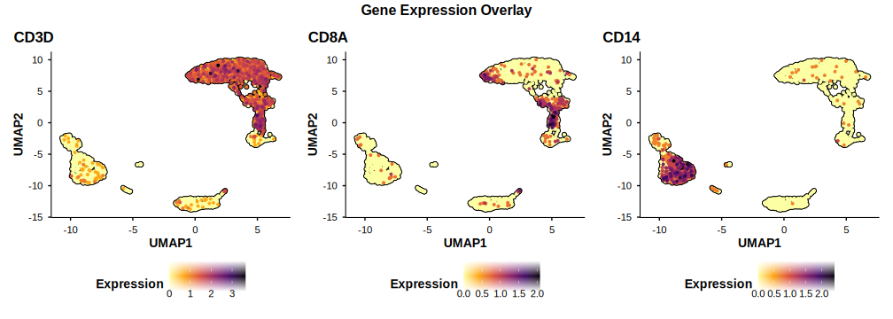
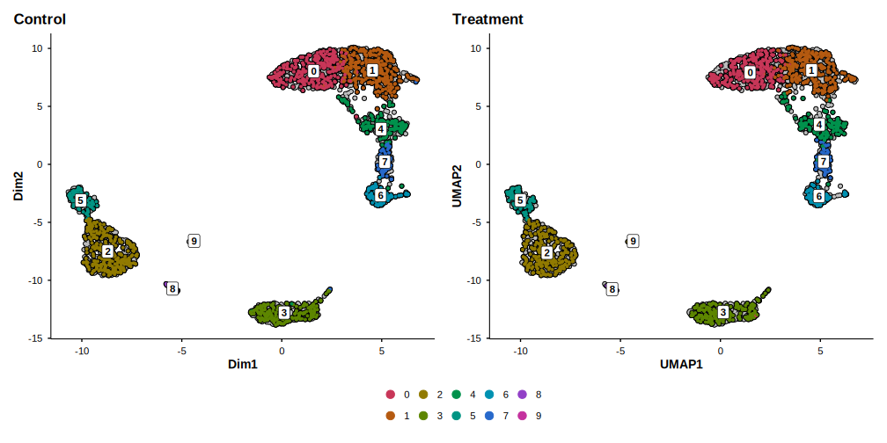
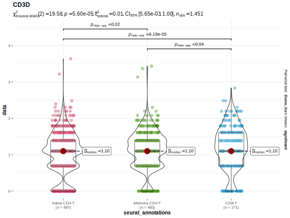

## Summary

Single-cell RNA sequencing (scRNA-seq) has become indispensable for dissecting cellular heterogeneity, yet a persistent disconnect separates exploratory analysis from the figures that appear in publications.
The Seurat toolkit [@hao2024; @stuart2019; @butler2018] --- the most widely adopted R framework for scRNA-seq --- provides plotting functions designed for rapid exploration, not for direct inclusion in manuscripts.
As a result, researchers repeatedly write the same boilerplate: computing and formatting PCA variance labels, adding cell borders for legibility, applying consistent themes, and building split-panel comparisons that retain the spatial context of the full embedding.

BadranSeq eliminates this burden.
Built entirely on native ggplot2 [@wickham2016], the package wraps the most common scRNA-seq visualisation tasks into single function calls that produce publication-ready output with no additional styling.
Key capabilities include automatic variance-explained annotations on PCA axes, cell border rendering, a silhouette-based split comparison that preserves spatial context across panels, statistical violin plots with integrated nonparametric testing via ggstatsplot [@patil2021], Sankey diagrams for categorical metadata relationships via ggalluvial [@brunson2020], tidy data extraction functions that replace `Seurat::FetchData()`, interactive brush-based cell selection, and a consistent publication theme applied across all outputs.
BadranSeq is available under the MIT licence at <https://github.com/wolf5996/BadranSeq>.

## Statement of Need

scRNA-seq enables gene expression profiling at single-cell resolution and has become a cornerstone of modern biology [@heumos2023; @luecken2019].
Seurat provides comprehensive workflows from raw count matrices through clustering, annotation, and visualisation, making it the *de facto* standard for scRNA-seq analysis in R.
Its plotting functions, however, prioritise generality over presentation quality.
Every project ends with the same ritual: computing PCA variance percentages, adding cell borders, styling themes, and constructing split-panel layouts that preserve embedding geometry.
This work is repeated across every analysis, every manuscript, and every laboratory.

The cost is not merely time.
Inconsistent visualisation code across projects hinders reproducibility of visual outputs and introduces opportunities for error.
SCpubr [@blancocarmona2022] addressed this gap with a large suite of specialised plotting functions, but its breadth introduces a correspondingly large dependency footprint --- often more than is justified when only core dimensionality reduction and feature plots are needed.

Three additional gaps remain underserved.
First, interactive cell selection: researchers frequently need to isolate spatially defined populations that do not correspond to existing metadata labels.
Seurat's `CellSelector()` is tightly coupled to its own plotting pipeline and lacks additive or subtractive selection modes.
Second, statistical annotation: comparing expression distributions across cell types requires manually extracting data, running tests, and formatting results onto plots.
Third, tidy data extraction: `FetchData()` returns a data.frame with barcodes trapped in rownames, mixes expression and metadata in a single call, and provides no control over expression layers.

BadranSeq addresses all of these.
It provides a lightweight, opinionated visualisation and data extraction layer covering UMAP, PCA, feature expression, elbow plots, statistical violin plots, Sankey diagrams, and tidy data extraction --- with defaults that require no additional customisation.
By building directly on ggplot2 rather than wrapping higher-level abstractions, every output remains a standard ggplot2 object that researchers can further modify using familiar syntax.

## State of the Field

Several tools address scRNA-seq visualisation in R.
Seurat's built-in `DimPlot()` and `FeaturePlot()` [@hao2024] provide basic plotting but require manual styling for publication use.
SCpubr [@blancocarmona2022] offers over 30 specialised plot types with publication aesthetics, at the cost of a large dependency tree.
dittoSeq provides colourblind-friendly visualisations with a focus on accessibility.
scater, part of the Bioconductor ecosystem, includes plotting utilities integrated with the SingleCellExperiment class.

BadranSeq occupies a distinct position.
Unlike Seurat's defaults, it produces publication-ready output without customisation.
Unlike SCpubr, it focuses on the core visualisation tasks that researchers use daily, resulting in a minimal dependency footprint.
Unlike dittoSeq and scater, it operates natively on Seurat objects and integrates directly with the dominant scRNA-seq workflow (@fig-comparison).

@tbl-comparison summarises the functional differences.

| Feature                        | Seurat | BadranSeq |
|:-------------------------------|:------:|:---------:|
| Variance explained on PCA axes |   No   |    Yes    |
| Cell borders                   |   No   |    Yes    |
| Cluster labels by default      |   No   |    Yes    |
| Split-panel silhouettes        |   No   |    Yes    |
| Publication theme              |   No   |    Yes    |
| Viridis feature plots          |   No   |    Yes    |
| Interactive cell selection     |  Limited  | Additive / subtractive |
| Automatic rasterisation        |   No   |    Yes    |
| Statistical violin plots       |   No   | Kruskal--Wallis |
| Sankey / alluvial diagrams     |   No   |    Yes    |
| Tidy data extraction           |  FetchData  | Tibble-based |

: Comparison of default capabilities between Seurat and BadranSeq. {#tbl-comparison}

## Software Design

BadranSeq is organised around a small set of user-facing functions that share a common internal engine and a consistent parameter interface (`object`, `reduction`, `group.by`, `split.by`, `plot_cell_borders`, etc.).
All functions accept a Seurat object as input and return native ggplot2 objects.

{#fig-comparison width="100%"}

The architecture follows a routing pattern: `do_DimPlot()` serves as a unified entry point, dispatching to `do_PcaPlot()` for PCA (which computes and formats variance-explained labels; @fig-pca), `do_UmapPlot()` for UMAP, or a generic handler for other reductions such as Harmony or t-SNE.
`do_FeaturePlot()` overlays gene expression on any reduction using viridis colour scales [@garnier2024], with support for quantile-based expression cutoffs (@fig-featureplot).
`EnhancedElbowPlot()` displays variance explained per principal component with optional cutoff annotation, and `get_pca_variance()` exposes the underlying variance data as a data.frame.

Because every output is a standard ggplot2 object, researchers are never locked into BadranSeq's defaults --- any plot can be incrementally adjusted using the full grammar of graphics.

{#fig-pca width="100%"}

{#fig-featureplot width="100%"}

### Theming and Colour

A shared theme function, `theme_badranseq()`, enforces consistent aesthetics across all outputs: white background, no grid lines, bold axis titles, and bottom-positioned legends.
The theme is exported for use on arbitrary ggplot2 objects, enabling visual consistency across an entire manuscript.
Colour generation uses the colorspace Dark 3 qualitative palette [@zeileis2020] with saturation increased by 0.2 and value decreased by 0.1 in HSV space, yielding vivid yet distinguishable categorical colours (@fig-elbow).

{#fig-elbow width="100%"}

### Split-Panel Silhouette Visualisation

When `split.by` is specified, BadranSeq renders every cell as a grey silhouette with borders in each panel, overlaying only the cells belonging to the current split category in colour.
This approach, inspired by SCpubr [@blancocarmona2022], preserves the spatial context that standard faceting destroys: in Seurat's default `split.by` behaviour, each panel contains only a subset of cells, making it impossible to judge where a subpopulation sits relative to the full embedding.
Panels are combined using patchwork with shared legends and consistent axis limits (@fig-silhouette).

{#fig-silhouette width="100%"}

### Statistical Violin Plots

`do_StatsViolinPlot()` wraps `ggstatsplot::ggbetweenstats()` [@patil2021] with Seurat-aware data extraction, automatic palette generation, and a `group.levels` argument for comparing specific cell type subsets without manually subsetting the object.
By default, a Kruskal--Wallis omnibus test and Dunn's pairwise comparisons (Holm-corrected) are performed and annotated directly on the plot.
The `pairwise.display` argument controls whether all pairs, only significant pairs, or no brackets are shown (@fig-violin).

{#fig-violin width="85%"}

### Sankey Diagrams

`do_SankeyPlot()` creates alluvial diagrams showing how cells distribute across two or three categorical metadata variables, powered by ggalluvial [@brunson2020].
A common application is visualising how computationally derived clusters correspond to biological cell type annotations: each stratum is labelled and coloured, and flows immediately reveal whether clusters map cleanly to single cell types or fragment across annotations (@fig-sankey).

{#fig-sankey width="90%"}

### Tidy Data Extraction

BadranSeq provides two data extraction functions that replace `Seurat::FetchData()`.
`fetch_cell_data()` returns cell-level metadata and embeddings as a tidy tibble with `cell_id` as an explicit column rather than trapped in rownames.
`fetch_feature_data()` returns expression data in long format --- one row per cell per feature --- with columns named after the requested layers (`counts`, `data`, etc.).
Both functions offer explicit control over embeddings, metadata columns, and expression layers, enabling composable dplyr and ggplot2 pipelines without manual reshaping.

### Interactive Cell Selection

`select_cells_interactive()` provides a Shiny-based interface for brush-selecting cells from any computed embedding.
Users can additively build a selection across multiple brush operations, subtractively remove cells, and clear to start over.
Selected cells are highlighted with red ring markers in real time, and the function returns either a character vector of barcodes or a subsetted Seurat object.
This is more flexible than Seurat's `CellSelector()`, which lacks additive and subtractive modes.

Additionally, `seurat_sleepwalk()` wraps the sleepwalk package [@ovchinnikova2020] for interactive exploration of how faithfully a 2D embedding preserves high-dimensional distances.

### Performance

For datasets exceeding 50,000 cells, BadranSeq automatically rasterises point layers via ggrastr, preventing prohibitively large vector graphics while keeping text and axes as sharp vector elements.
The threshold is configurable through the `raster` parameter.

## Availability and Reproducibility

BadranSeq is publicly available on GitHub and installable via standard R package managers.
The package ships with a bundled PBMC 3k dataset (SCTransform-normalised, with PCA and UMAP precomputed) for immediate testing and reproducible examples.
A pkgdown documentation site at <https://wolf5996.github.io/BadranSeq/> provides function references and usage vignettes.
Continuous integration via GitHub Actions runs `R CMD check` on macOS, Windows, and Ubuntu.

## Acknowledgements

The aesthetic design of BadranSeq draws on SCpubr [@blancocarmona2022] by Enrique Blanco Carmona.
Design elements adapted from SCpubr include cell border rendering, colour palette generation, and the silhouette split approach.
BadranSeq differs by providing a lighter-weight, native ggplot2 implementation with additional features: PCA variance labels, statistical violin plots, Sankey diagrams, tidy data extraction, and interactive cell selection.

The author thanks the developers of R [@rcore2024], Seurat [@hao2024], ggplot2 [@wickham2016], ggstatsplot [@patil2021], ggalluvial [@brunson2020], and UMAP [@mcinnes2018] for the foundational tools upon which BadranSeq is built.

## References
